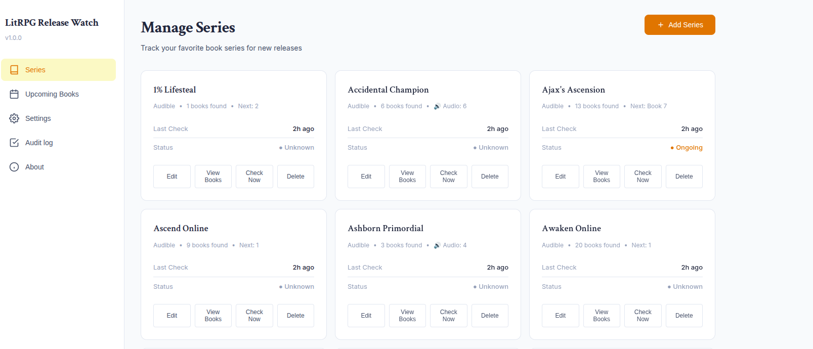
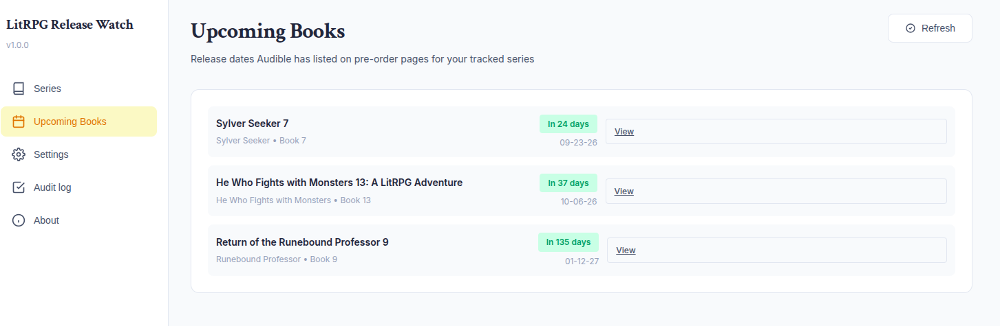
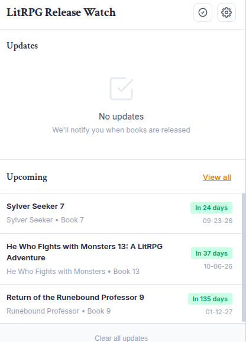

# LitRPG Release Watch

Stop refreshing Audible to see if the next book is out yet.

**Free · No account · No tracking · Data stays local**

A Chrome/Brave extension that watches Audible (and optionally Amazon) for
new installments in the LitRPG/progression-fantasy series you follow, and
tells you the moment a new book shows up - along with a running list of
already-announced pre-orders and their release dates.

*Independent project; not affiliated with or endorsed by Audible or Amazon.*

## Why I built it

LitRPG series update on no fixed schedule, and new audiobooks routinely get
buried in a wall of unrelated search results, translated editions, and
merchandise. I got tired of manually checking a growing list of series for
new releases, so I built a tracker that does the checking and only surfaces
the signal: a new book by the right author, in the right series, in English.

## What it does

- **Tracks any series by an Audible search URL** (and optionally an Amazon
  series URL) - no API keys or catalog IDs needed
- **Checks automatically on a schedule** (default every 12 hours) and on
  demand
- **Notifies you the moment a new installment appears**, with desktop
  notifications and an unread-count badge on the toolbar icon
- **Hybrid detection**: compares book numbers extracted from titles when
  available, and falls back to ASIN-based tracking for series that don't
  number their books in the title
- **Author-locking**: pins detection to the series' real author(s) so an
  unrelated book that happens to share words with the series title can't be
  mistaken for a new release (or block a real one) - with auto-suggest from
  your own search results
- **English-only filtering**: layered checks (foreign-language heuristics,
  book-number cross-checks, narrator cross-checks) keep translated editions
  and cross-series pollution out of both notifications and the Upcoming
  Books list
- **Upcoming Books**: a running list of pre-orders Audible has already
  published release dates for, across all your tracked series, shown in
  both the popup and a dedicated options-page tab
- **Audit log**: every check is recorded - what was scraped, what was
  accepted or rejected and why - so you can see exactly why (or why not) a
  book triggered an alert
- **Quiet hours** for notifications, a configurable poll interval, and a
  max-book-age filter to suppress noise from old catalog entries
- **Export / import** your full series list and snapshot history as JSON
  (backup, migrate, or move between browsers), plus a CSV snapshot export
  for spreadsheet digging

**No account. No analytics or tracking of any kind.** Everything runs in
your own browser and talks directly to Audible/Amazon pages you've pointed
it at. See [Privacy & Data](#privacy--data) below for exactly what's stored
and where.

**Audible/Amazon only**, and compatibility is best-effort - these sites
change their page structure without notice, and the scraper's selectors can
break as a result. See [Known Limitations](#known-limitations).

## Screenshots


*The Series tab - each card shows the next expected installment, last check time, and completion status.*


*Upcoming Books - pre-orders Audible has already listed a release date for, across every tracked series.*


*The popup - recent updates and upcoming releases at a glance, with one-click "Check Now".*

## Installation

This extension is not published on the Chrome Web Store - it's loaded as an
unpacked extension in Developer Mode. You'll need Chrome, Brave, or another
Chromium-based browser.

### Option 1: Download the ZIP

1. Download the latest release ZIP (or the repository ZIP) from the
   [Releases page](https://github.com/charlesmomeny/litrpg-release-watch/releases)
2. Unzip it to a folder on your computer
3. Go to `chrome://extensions/`
4. Enable **Developer mode** (toggle, top right)
5. Click **Load unpacked** and select the unzipped folder
6. Confirm you see "LitRPG Release Watch" in your extensions list

### Option 2: Clone with Git (for developers)

1. `git clone https://github.com/charlesmomeny/litrpg-release-watch.git`
2. Go to `chrome://extensions/`, enable **Developer mode**, click
   **Load unpacked**, and select the cloned folder

## How to Use

### Add a series

1. Click the extension icon → gear icon (or the **Series** tab in Options)
2. Click **Add Series**
3. Give it a title, and paste an **Audible search URL** for it - go to
   Audible, search the series name, and copy the URL from your address bar
4. Fill in **Expected Author(s)** (strongly recommended - click **Test
   URLs** first and it will auto-suggest one from your search results).
   This locks new-release detection to the real author so unrelated results
   can't be mistaken for (or block) a genuine new book
5. Optionally set the current next-installment number and an Amazon series
   URL
6. Click **Test URLs** to validate before saving, or **Save Series** to
   start tracking

### Get notified of new releases

Nothing else to do - the extension checks all enabled series on its poll
interval (Settings tab, default 12 hours) and whenever you click **Check
Now** in the popup or **Check All Series** in Options. A new installment
triggers a desktop notification and a badge count on the toolbar icon.

### See what's coming

The **Upcoming** section in the popup, and the **Upcoming Books** tab in
Options, list every pre-order with a known release date across your tracked
series, soonest first.

### Investigate a check

Open the **Audit log** tab in Options to see, per series, what was scraped
on the last check and why each candidate book was accepted or rejected
(wrong author, non-English, book-number mismatch, too old, etc.).

### Back up or move your data

Options → Settings → **Snapshot Export** section has **Full Snapshot
Export** (complete JSON backup of series, snapshots, settings, updates -
paired with an **Import** button to restore it) and **Snapshot Summary**
(CSV export of every book ever scraped, for spreadsheet use).

## How It Works

1. **You give it a search URL, not an API.** There is no Audible or Amazon
   API integration - the extension opens the search URL you provide (in a
   hidden background tab when needed, to work around bot detection) and
   parses the resulting page directly in your browser.
2. **Snapshots.** Each check saves the full list of items found for a
   series/source pair. The next check is compared against that snapshot to
   detect what changed - a new item, a release date shift, a pre-order
   flipping to available, or (Audible only) a narrator/runtime change.
3. **Number-based first, ASIN-based fallback.** When a series numbers its
   audiobooks in the title (e.g. "Savage Awakening 7"), new releases are
   detected by tracking the highest number seen. Series that don't number
   their titles fall back to tracking by ASIN (Audible's catalog ID).
4. **Filtering layers keep alerts clean**, in order: does the title
   plausibly match the series name; is the author on the expected-author
   list (or, absent that, one of the authors already trusted from prior
   snapshots); is it in English (heuristics catch diacritics, non-Latin
   scripts, and common foreign function words without relying on
   diacritics alone); is it within the configured max book age. Every
   candidate that passes or fails is recorded to the audit log with its
   rejection reason.
5. **Upcoming Books** is computed from the same snapshots - it just filters
   for items still marked as pre-orders that have a release date, applying
   the same series-name/English/author checks plus a book-number
   cross-check against the series' already-computed "next" number.

## Privacy & Data

Everything this extension does happens locally in your browser. It makes no
requests to any server other than the Audible/Amazon URLs you explicitly
configure - there is no analytics, telemetry, or backend component of any
kind, and nothing you save or configure is ever sent anywhere else.

**What's stored**, in your browser's local extension storage
(`chrome.storage.local`), never synced or shared unless you explicitly use
Export:
- `series` - the series you're tracking (title, search URLs, expected
  author, completion status, next-installment number)
- `snapshots` / `snapshotHistory` - the most recent (and last few) scraped
  results per series/source, used to detect changes
- `bookHistory` - every book (by ASIN) ever seen, so a title that
  temporarily disappears from search results is still recognized when it
  reappears
- `updates` - the notification history shown in the popup
- `auditLog` - the last 14 days of per-check diagnostic detail
- `settings` - your poll interval, quiet hours, filters, and other
  preferences

## Known Limitations

- **Audible and Amazon only**, and only as far as their public search/series
  pages go - no login, no purchase history, no library integration.
- **Best-effort DOM compatibility.** Audible and Amazon change their page
  structure without notice, and the scraper's selectors can break as a
  result. If tracking stops working for a series, check the Audit log tab
  first.
- **Bot detection.** Audible in particular can rate-limit or block
  automated-looking requests; the extension falls back to scraping via a
  hidden background tab when this happens, but persistent blocking will
  surface as an error notification and an entry in the error log.
- **English-only filtering is heuristic, not perfect.** It's tuned against
  German, French, Spanish, and Italian editions seen in practice, but a new
  foreign edition could occasionally slip through, or (more likely) get
  wrongly rejected until the heuristics are extended.
- **Amazon checking exists in the code but isn't wired into the automated
  check** - Amazon search results for books tend to be dominated by
  unrelated merchandise, which made this source noisier than Audible's.
- **No sync.** Your tracked series and history live only in the local
  browser profile they were saved in; use Export for backups or moving
  between machines.

## File Structure

```
litrpg-release-watch/
├── manifest.json     # Extension configuration (MV3)
├── background.js     # Service worker: scheduling, orchestrating checks, notifications
├── scraper.js         # Fetch + hidden-tab fallback scraping, with retry/backoff
├── parsers/
│   ├── audible.js     # Audible search-results page parser
│   └── amazon.js       # Amazon series page parser
├── diff.js            # Number/ASIN-based change detection, author/language/age filtering, audit trail
├── upcoming.js        # Shared "Upcoming Books" computation (popup + options)
├── notifications.js   # Desktop notifications, badge, quiet hours
├── storage.js          # chrome.storage.local data access layer
├── export.js           # CSV snapshot export
├── utils.js            # Date normalization, ASIN extraction, series-name matching
├── popup.html/.js/.css       # Toolbar popup (updates + upcoming)
├── options.html/.js/.css     # Full settings UI (series, upcoming, settings, audit log, about)
└── assets/              # Extension icons
```

## License

[MIT](LICENSE)
